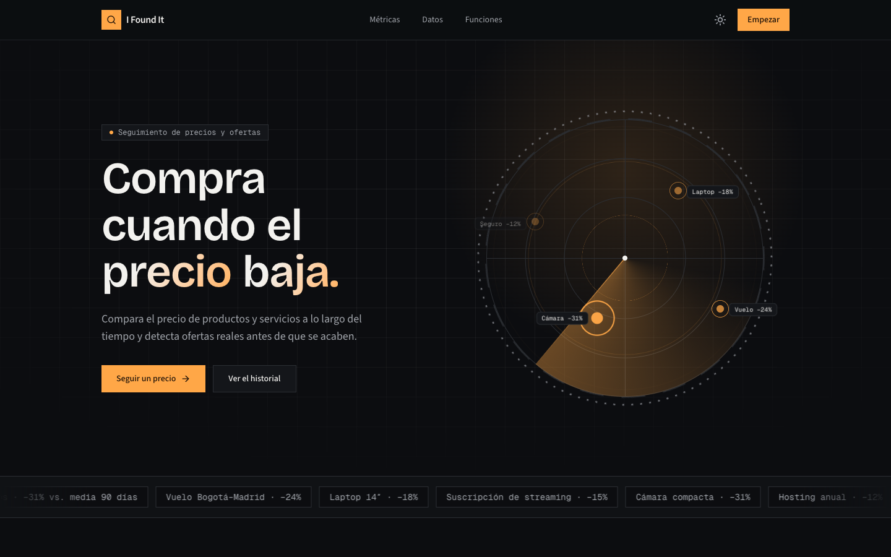
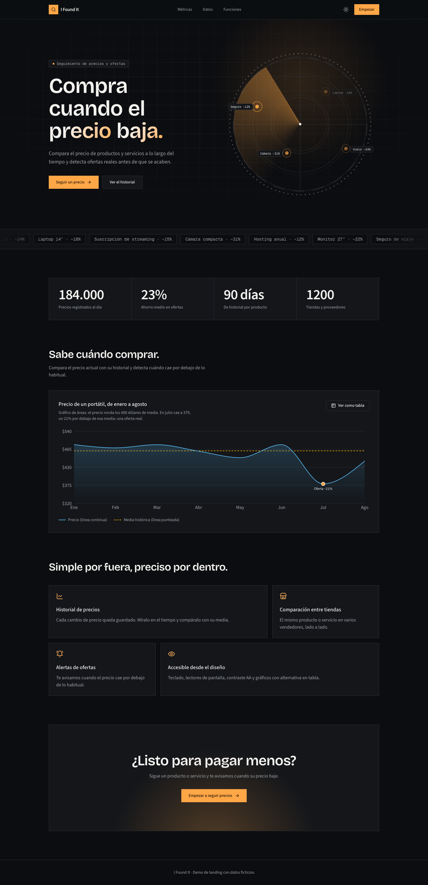

# Vida lo encontre! ( i-found-it-app )

SPA de visualización de datos para comparar precios de productos y servicios a lo largo del tiempo y detectar ofertas. Dashboard minimalista, accesible y rápido.

## Vista previa

Demo del landing (datos ficticios):



<details>
<summary>Ver la página completa</summary>



</details>

## Arquitectura del proyecto

### Principios

- **Minimalismo**: tipografía, rejilla, espacio en blanco y un solo color de acento. La identidad no depende de efectos.
- **Animación opt-in**: por defecto solo transiciones CSS cortas (150–200 ms). Motion se usa únicamente donde lo decidimos, y todo respeta `prefers-reduced-motion`.
- **Accesible por defecto**: WCAG AA como mínimo, verificado de forma automática en CI.

### Stack

| Capa | Elección |
|---|---|
| Build | Vite + React 19 + TypeScript (strict) |
| Routing | TanStack Router (file-based, con code-splitting por ruta) |
| Datos del servidor | TanStack Query sobre un cliente REST |
| Estado de UI | Zustand (solo estado local de interfaz) |
| Estilos y componentes | Tailwind CSS v4 + shadcn/ui (Radix) |
| Gráficos | shadcn Charts sobre Recharts (Apache ECharts como reserva para casos exigentes) |
| Tablas | TanStack Table + TanStack Virtual |
| Fechas y filtros | react-day-picker + date-fns |
| Mapa (si aplica) | MapLibre GL |
| Formularios | React Hook Form + Zod |
| Animación (opt-in) | CSS y Motion |
| Calidad | Biome, Vitest + Testing Library + vitest-axe, Playwright + @axe-core/playwright, Husky + lint-staged |
| Extras | vite-plugin-pwa, React Compiler |

### Comunicación con el backend

Por ahora la app se comunica únicamente por **REST**. Todas las llamadas pasan por el cliente HTTP de `src/lib/`, y cada *feature* expone sus funciones y hooks de Query en su carpeta `api/`. Los esquemas Zod validan las respuestas, así la UI nunca depende de datos sin validar. Si el backend cambia, solo se toca esa capa.

### Estructura de carpetas

```
src/
  app/          # providers, router, layout raíz, estilos globales
  routes/       # definición de rutas (TanStack Router, file-based)
  features/     # un módulo por dominio
    <feature>/
      api/        # funciones REST y hooks de TanStack Query
      components/ # componentes propios del feature
      hooks/      # hooks propios del feature
      schemas/    # esquemas Zod y tipos derivados
    dashboard/    # vistas y widgets del dashboard
  components/   # UI compartida
    ui/           # componentes base (shadcn)
    charts/       # wrappers de gráficos con alternativa accesible en tabla
    layout/       # shell, navegación, contenedores
    motion/       # wrappers de animación opt-in
  lib/          # cliente HTTP, utilidades, configuración
  styles/       # tokens de diseño (colores OKLCH, tipografía, easing)
  test/         # setup y helpers de pruebas
```

### Reglas

- Un *feature* no importa de otro *feature*. Solo importa de `components/` y `lib/`. El linter lo hace cumplir.
- El estado del servidor vive en TanStack Query; Zustand queda para estado de interfaz.
- Las rutas son delgadas: componen componentes de `features/` y definen *loaders*.
- Los tokens visuales (colores, tipografía, easing) viven en `styles/` y no se hardcodean en componentes.

### Gráficos y accesibilidad

- Todo gráfico se crea con los wrappers de `components/charts/`, que incluyen título, descripción textual (`aria-label`, `aria-describedby`) y un botón "Ver como tabla" con los mismos datos.
- El color nunca es el único canal de información: se suma forma, patrón o etiqueta directa.
- Paletas categóricas seguras para daltonismo (Okabe-Ito o Paul Tol), definidas en OKLCH y con contraste AA.
- Foco visible, orden de tabulación lógico y modo oscuro con contraste verificado.
- Las pruebas de accesibilidad (`vitest-axe` en componentes y `@axe-core/playwright` en E2E) se ejecutan en CI y un fallo rompe el build.
